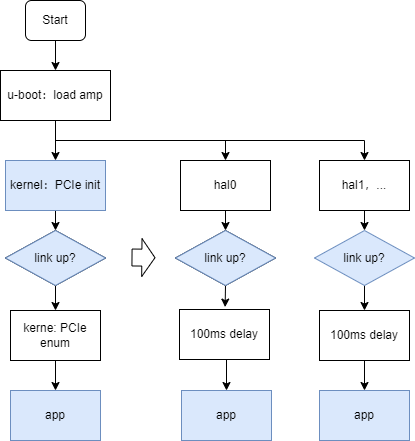

# Rockchip HAL PCIe 用户指南 {#Rockchip_User_Guide_HAL_PCIe}

发布版本：V1.0.0

日期：2023-04-04

文件密级：□绝密   □秘密   □内部资料   ■公开

**免责声明**

本文档按“现状”提供，瑞芯微电子股份有限公司（“本公司”，下同）不对本文档的任何陈述、信息和内容的准确性、可靠性、完整性、适销性、特定目的性和非侵权性提供任何明示或暗示的声明或保证。本文档仅作为使用指导的参考。

由于产品版本升级或其他原因，本文档将可能在未经任何通知的情况下，不定期进行更新或修改。

**商标声明**

“Rockchip”、“瑞芯微”、“瑞芯”均为本公司的注册商标，归本公司所有。

本文档可能提及的其他所有注册商标或商标，由其各自拥有者所有。

**版权所有 © 2023 瑞芯微电子股份有限公司**

超越合理使用范畴，非经本公司书面许可，任何单位和个人不得擅自摘抄、复制本文档内容的部分或全部，并不得以任何形式传播。

瑞芯微电子股份有限公司

Rockchip Electronics Co., Ltd.

地址：     福建省福州市铜盘路软件园A区18号

网址：     [www.rock-chips.com](http://www.rock-chips.com)

客户服务电话： +86-4007-700-590

客户服务传真： +86-591-83951833

客户服务邮箱： [fae@rock-chips.com](mailto:fae@rock-chips.com)

---

**前言**

**概述**

本文介绍 HAL PCIe 的使用说明，HAL 源码可用于 bare metal 或 RTOS 系统环境，仅支持简单功能操作。

| **芯片名称** | **内核版本** |
| ------------ | ------------ |
| 所有平台     | HAL/RTOS     |

**读者对象**

本文档（本指南）主要适用于以下工程师：

技术支持工程师

软件开发工程师

**修订记录**

| **版本号** | **作者** | **修改日期** | **修改说明** |
| ---------- | -------- | ------------ | ------------ |
| V1.0.0     | 林鼎强   | 2023-04-04   | 初始版本     |

---

**目录**

[TOC]

---

## 简介

由于 bare metal 或 RTOS 工程下无完整的 PCIe 框架代码，需依赖 u-boot 或 Linux 下的 PCIe 初始化及枚举流程，bare metal 或 RTOS 下仅支持以下简单功能：

- 控制器寄存器访问
- CPU 访问外设，主要包括 Bar、CFG 空间
- uDMA 传输
- INTx legacy 中断

详细接口参考应用说明。

## 规范说明

### 启动流程

**kernel 初始化 PCIe 方案（推荐）**



说明：

- 流程中的 “100 ms delay” 为等待 PCIe 外设驱动加载完成的冗余时间，可用业务代码上的握手协议替代
- kernel PCIe 开发参考《Rockchip_Developer_Guide_PCIe_CN.pdf》文档，可通过 lspci 命令获取 bdf、bar 映射 等重要信息

**u-boot 初始化 PCIe 方案**


- 流程中的 “100 ms delay” 为等待 PCIe 外设驱动加载完成的冗余时间，实际上 u-boot 已完成该流程，冗余延时可手动删除
- u-boot PCIe 开发参考《Rockchip_Developer_Guide_UBoot_Nextdev_CN.pdf》文档 PCIe 章节，主要涉及：
    - “加载 kernel dtb 之前使用 PCIe” 配置说明
    - pci cmd 获取 PCIe 外设信息，包括 bdf、bar 映射 等重要信息

### 资源分配

PCIe 除了 CPU 访问 Bar 资源，其他资源通常都涉及竞争，所以多系统公用同一个 PCIe 控制器，应预先分配好资源：

| 资源              | 说明                                                         |
| ----------------- | ------------------------------------------------------------ |
| CPU 访问 Bar 资源 | 不涉及竞争，多核访问由总线仲裁                               |
| CPU 访问 CFG 空间 | 读不涉及竞争，写涉及一致性问题                               |
| uDMA              | 支持 2 通道，通道之间独立，但多核访问同一个 DMA 通道涉及竞争 |
| INTx              | 涉及竞争                                                     |
| 控制器寄存器      | 应尽量避免同时访问，根据实际情况细化分析                     |
| MSI               | 仅 kernel 中支持                                             |

## 应用说明

### CPU 访问外设 CFG 空间

参考 test_pcie.c 代码，主要包括以下接口使用：

- 映射 CFG 空间，"u-boot 初始化 PCIe 方案" 需添加该处理，以 u-boot 枚举设备 01.00.00 为例：

```c
#define TEST_DEVICE                 PCI_BDF(0x01, 0x00, 0x00)

index = HAL_PCIE_OutboundConfigCFG0(&g_pcieDev, TEST_DEVICE, 0x100000);
```

- 读写 CFG 空间，其他接口参考 hal_pch.h 文件：

```c
HAL_PCI_ReadConfigWord(cfg, PCI_VENDOR_ID, &vid);
HAL_PCI_ReadConfigWord(cfg, PCI_DEVICE_ID, &did);
```

### CPU 访问外设 Bar 空间

参考规范说明，获取外设信息，参考 test_pcie.c 代码调用以下接口完成 Bar 空间 CPU 访问：

```c
memset_io()
memcpy_fromio()
memcpy_toio()
```

### uDMA 传输

参考 hal_pcie.c 文档 doxygen 注释 PCIE_How_To_Use 说明，实际参考 test_pcie.c 实例。

### INTx 中断

参考 test_pcie.c 注册 INTx 中断，接入如下：

```c
HAL_IRQ_HANDLER_SetIRQHandler(g_pcieDev.legacyIrqNum, PCIE_INTxIsr, NULL);
```

说明：

- AMP 环境下 Linux 系统端仅使能 MSI/MSI-X中断，所以 legacy 中断可供 HAL 环境下，分配方案参考：
    - Core A 使用 Linux，独占 MSI/MSI-X 中断
    - Core B 使用 HAL/RTOS，独占 legacy INTx 中断
    - Other Cores，无独占中断资源，仅能由 CoreA/B 通知
- 由于 INTX 中断为电平中断，HAL legacy 中断回调函数中需要清中断，通常是通过 Bar 映射的寄存器去清除 FPGA 触发的 INTX 电平，请用户根据对接的 PCIe 外设实现接口
- 由于 HAL 框架下没有对外设做 INTX 号分配，为默认值，请用户根据实际应用分配 INTx 中断号给外设